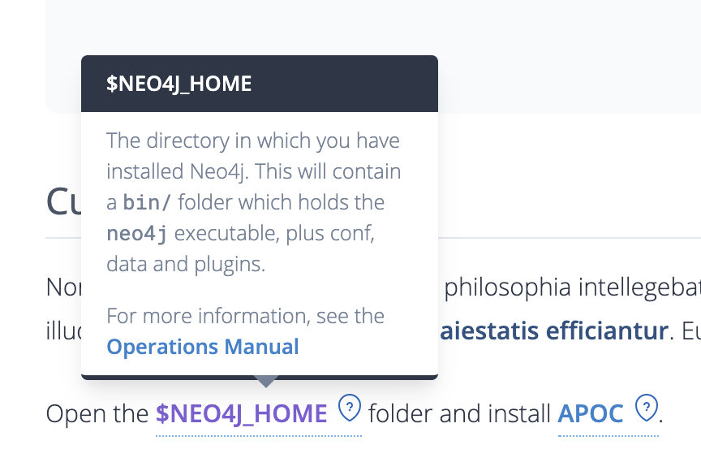
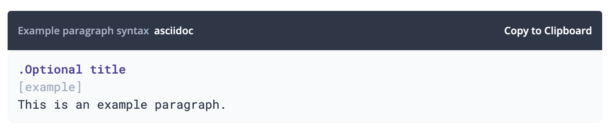
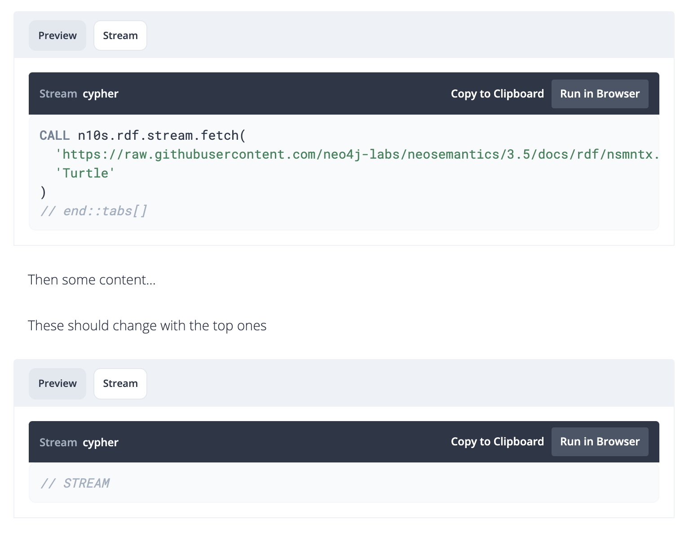

= Neo4j Developer Guides & Static Content

image::https://github.com/neo4j-documentation/docs-refresh/workflows/Publish%20Developer/badge.svg[Publish Developer] image::https://api.netlify.com/api/v1/badges/e217b188-6e70-447e-895a-9d8a290b59d2/deploy-status[Netlify Status]


This is an unversioned repo with folders to the different content that will be built with Antora.

Each directory will have a antora.yml file with configuration, then the `start_path` in antora-playbook.yml will define which subfolder is picked up.


== Installation

In order to build the content,

[source,sh]
npm i

The npm install command will install link:https://docs.antora.org/antora/2.3/cli/[Antora CLI^], which is then used to build the content defined in the Antora Playbooks (`*.yml` files in the project root).


== Build

To build the content, run the build command:

[source,sh]
npm run build

== Preview

You can run a local server to preview the built content by running:

[source,sh]
npm start

This will launch a server at http://localhost:8000/


== Publishing

Any changes to the `master` branch will trigger an automatic rebuild of _all content_ using Github Actions.  The action runs the `npm run build` command which builds the following playbooks using the Antora CLI:

- `unversioned.yml` - Developer guides at `neo4j.com/developer/*` and Labs pages at `neo4j.com/labs/*`
- `labs-docs.yml` - Builds the documentation from remote sources into `neo4j.com/labs/{project}/{version}`
  - link:https://neo4j.com/labs/neo4j-helm/1.0.0/[Helm^]
  - link:https://neo4j.com/labs/apoc/4.1/[APOC^]
  - link:https://neo4j.com/labs/neosemantics/4.0/[Neosemantics^]
  - link:https://neo4j.com/labs/kafka/4.0/[Neo4j Streams/Kafka^]
  - link:https://neo4j.com/labs/neo4j-helm/1.0.0/[Helm^]
  - link:https://neo4j.com/labs/etl-tool/1.5.0/[ETL Tool^]


The HTML files built by the build command are uploaded to the `static-content.neo4j.com` S3 Bucket, where it is synced hourly with the link:neo4j.com[] server.  The cronjob runs on the hour, every hour so it may take up to an hour for the content to become live.


// === Publishing Content

// To publish an individual section, merge and push your changes to the publish branch of the appropriate repository.

// [source,sh]
// git clone https://github.com/neo4j-documentation/developer-guides
// git add .
// git commit -m "My changes"
// git push origin HEAD:publish

// This will trigger a workflow to rebuild the content and sync the content to the S3 Bucket using link:https://github.com/neo4j-documentation/developer-guides/actions[Github Actions^].


== Theme Specifics

=== Pagination

To add previous/next links to the page, add `:page-pagination:` to the page attributes.

==== Disabling the Previous Link

Sometimes the previous link will point to a page in another section, to disable this you can set the  `:page-pagination:` attribute to:

[source]
:page-pagination: next

==== Disabling the Next Link

If you want to hide the Next link you can set the  `:page-pagination:` attribute to:

[source]
:page-pagination: previous


=== Page Level

Setting the page level is slightly different to before:

[source,asciidoc]
----
include::./ui/preview-src/labs.adoc[tag=level]
----

This will generate a coloured button to represent the level.


=== Themes

You can set the _theme_ for the page by setting the `page-theme` attribute.
This adds a css class to the `<body>`  tag when the page is rendered, which is then used by the CSS to change the colours of certain elements on the page.

[source,asciidoc]
----
include::./ui/preview-src/labs.adoc[tag=theme]
----

The available themes are:

* developer - Grey top menu with green accent
* labs - White top menu with purple accent
* docs - White top menu with blue accent


=== Layouts

In most cases, you won't need to do anything to set a layout.  If you do need to change the layout you can use the `page-layout`

[source,asciidoc]
----
include::./ui/preview-src/labs.adoc[tag=layout]
----

The available themes are:
* `default` - The default layout with header, sidebar, ToC etc.
* `labs` - The layout used for the labs home page, this page features a large hero/banner and no sidebar.  This is intended ot be used on the labs homepage.
* `tiles` - This page converts `.sect2` divs into cards with a white background and shadow.  This is intended to be used for the docs homepage.

== Search

In order to improve the search experience for users, please consider setting the following page attributes:

// include::./ui/preview-src/index.adoc[tag=meta]
// include::./ui/preview-src/index.adoc[tag=search]
[source,adoc]
----
:page-type:
:page-neo4jversion: 3.5
:page-product: browser
:description: This guide shows the different ways you can import data from a relational database to Neo4j. Completing this guide will give you the tools to choose how to import your relational data and transform it to the graph.
:keywords: one, two, three, four
----

* Page Types: [“Tutorial”, “API Reference”, “Guide”, “Developer Guide”. etc]
* Product [“database”, “cypher”, “bloom”, “apoc”, etc]
* version (optional) ["4.0", "4.1", etc]

== Features

=== Glossary Terms & Info Tooltips

**Every page is page one**.
Do not assume any previous knowledge of the user.

For terms that the user may not be familiar with, you can add a Glossary to the page.
The glossary itself is hidden, but each piece of text that references a glossary term will be highlighted.
When the reader hovers over the term with their mouse, a


The glossary should be added to the bottom of the page, adding `[discrete.glossary]` above the glossary will ensure that the glossary is hidden from the page.

[source,adoc]
----
include::./ui/preview-src/index.adoc[tag=glossary]
----

Then, terms can be referenced throughout the document.

[source,adoc]
----
include::./ui/preview-src/index.adoc[tag=glossary_term]
----

The result will look something like this:



[TIP]
Glossary terms are highlighted by link:ui/src/js/06-code.js[]


=== Source Blocks

When the page is loaded, a header is added to each source block.
Each block will have the language placed to the left and a **Copy to Clipboard** button to the right of the header.


[source,adoc]
----
include::./ui/preview-src/index.adoc[tag=source]
----

If the language is set to cypher (`[source,cypher]`), a **Run in Browser** button is also added.
This will use Neo4j Desktop's deeplinks to open up the Neo4j Browser Graph App with the query pre-filled.

If you supply a title (eg, `.Title`), this will be prepended to the start of the code header.



[TIP]
Source blocks are modified by link:ui/src/js/06-code.js[].  The source is highlighted using highlight.js, the colours are defined in link:ui/src/css/highlight.css.


==== Tabbed Source Blocks

If you are writing a tutorial for multiple languages, you can use the `[.tabs]` directive to include tabs.
The text on the tab will default to the title, or fallback to the language if no title is supplied.
When clicking on a tab, all other tab sets with the same title will also be made active across the page.

[source,adoc]
----
include::./ui/preview-src/index.adoc[tag=tabs]
----

The script will find all HTML `div` elements with a class of `tabs`, then iterate through the next sibling while the element contains a code block until it reaches one without.
At this point, if the number of elements is more than one, it will create a set of tabs and add event listeners to switch the tabs on click.



Tabs are added to the page in link:ui/src/js/06-code.js[]


=== Videos

[source,adoc]
video::_D19h5s73Co[youtube]

=== Meta Tags

To set/modify the page's meta tags, you can use the  `:description:` and  `:keyword:` attributes:

[source,adoc]
----
include::./ui/preview-src/index.adoc[tag=meta]
----


=== Comments!

By setting the `page-comments` attribute to ~true~ _anything_, a script tag will be added to load in a comments box.
The script will also create a new topic by default, or if a topic already exists or you would like to use another topic, you can use the `:page-topicid:` attribute.

[source,adoc]
----
:page-comments:
:page-topicid: 1234
----

Settings:
* link:https://community.neo4j.com/admin/customize/embedding[Embedding Settings^]
* link:https://community.neo4j.com/admin/customize/themes/9/common/embedded_scss/edit[CSS Styling of Box^]


== Migrating from the old Developer Guides

=== Variables, Attributes, etc

Instead of defining variables in a text file (think `versions.txt`), these are now defined under `asciidoc` and `attributes` in either the playbook (eg `developer.yml`) or inside `antora.yml` in the content repo.

.developer.yml playbook
[source,yaml]
----
asciidoc:
  attributes:
    page-theme: developer
    page-cdn: /static/assets
----

.antora.yml in content repo
[source,yaml]
----
asciidoc:
  attributes:
    img: https://dist.neo4j.com/wp-content/uploads/
    theme: developer
    neo4j-ogm-version: 3.1.6
    spring-data-neo4j-version: 5.1.3.RELEASE
    neo4j-stable-version: 4.0.3
    bolt-driver-version: 1.7.0
    java-driver-version: 4.0.1
----

=== Page Level

[source,adoc]
----
:level: Beginner
[role=expertise]
{level}
----

Becomes:

[source,adoc]
----
:level: Beginner
[role=expertise {level}]
{level}
----


=== Renamed Attributes

[%header,cols=2*]
|===
| Old Name | New Name

| slug | _Not required_
| icons | _Not required_
| section | _Not required_
| section-link | _Not required_
| setanchors | _Not required_
| toc | _Not required_
| toc-title | _Not required_
| setanchors | _Not required_
| toclevels | _Not required_
| toc-placement | _Not required_
| northwind | _Not required_
| level | Create an additional attribute called `:page-level:`
|===


// == Content

// === Developer
// ```
// /developer                           <- developer home page
// /developer/get-started               <- structured content
// /developer/get-started/rdbms-vs-graph
// /developer/get-started/nosql-vs-graph
// /developer/get-started/nosql-vs-graph
// /developer/platform
// /developer/platform/neo4j-browser
// /developer/platform/neo4j-bloom
// /developer/platform/neo4j-desktop
// /developer/platform/graph-apps      <- (or neo4j-desktop/graph-apps)
// /developer/cypher
// /developer/cypher/filtering
// /developer/cypher/subqueries
// /developer/cypher/user-defined-functions
// /developer/modeling
// /developer/modeling/worked-example
// /developer/drivers/
// /developer/drivers/java
// /developer/drivers/javascript
// /developer/drivers/dotnet
// ```

// === Labs
// ```
// /labs                                <- Labs homepage with list of all projects
// /labs/apoc                           <- About page for APOC
// /labs/apoc/quick-start               <- Quick start "guide"
// /labs/apoc/docs                      <- Hard core Manuals/"reference"
// /labs/apoc/docs/3.5
// /labs/apoc/docs/4.0
// /labs/neosemantics                   <- About page for Neosemantics
// /labs/neosemantics/quick-start       <- Quick start "guide"
// /labs/neosemantics/docs              <- Hard core Manuals/"reference"
// /labs/neosemantics/docs/3.5
// /labs/neosemantics/docs/4.0
// ```


// === Migration

// ```
// :level: Beginner
// [role=expertise]
// {level}

// becomes

// :page-level: Beginner
// ```